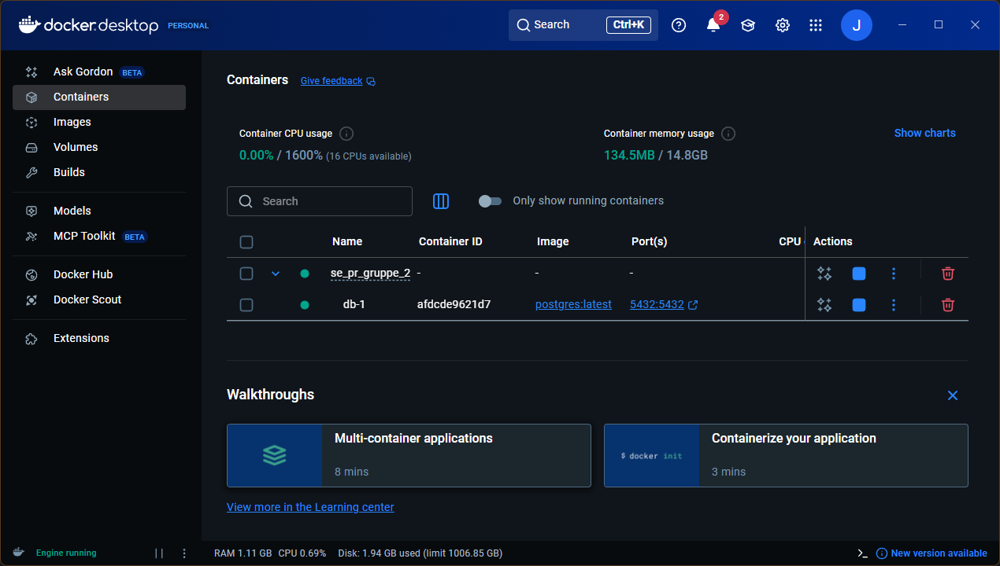
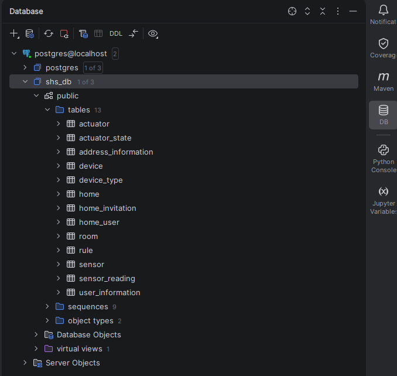
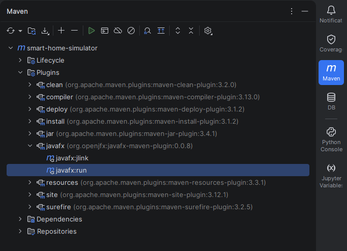
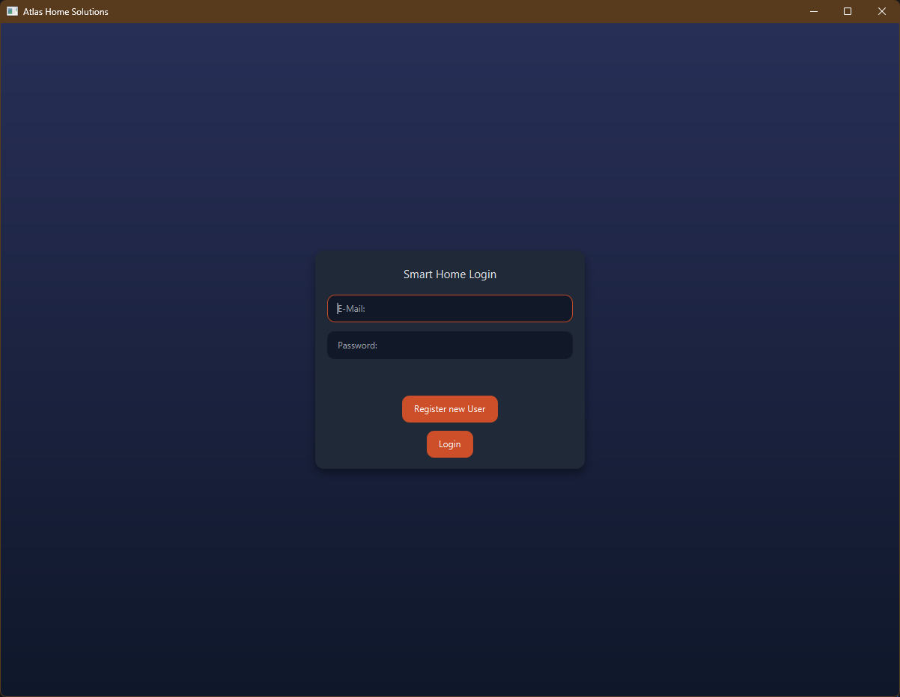
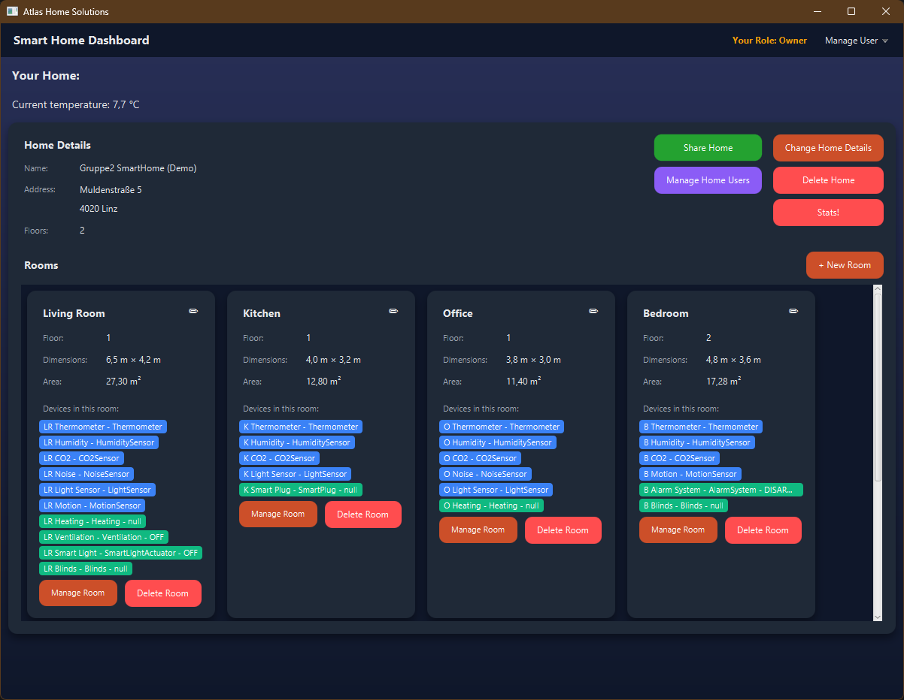
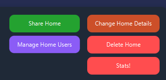
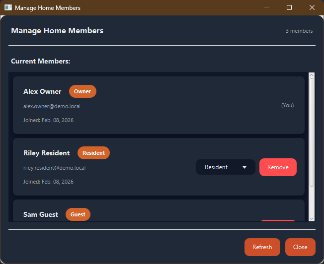
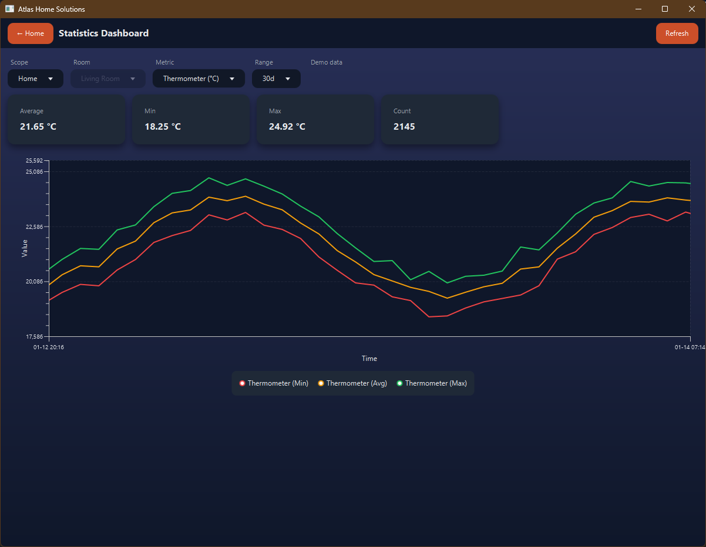

# Installation & Startup Manual

[Jump to using the App immediately](#using-the-application)

This page is best viewed in the IDE itself!

## 1. Purpose

This document describes how to install, configure, and run the **Smart Home Simulator application** on a local development machine.  
The application uses **Docker** to provide a PostgreSQL database and runs the application itself locally.

---

## 2. System Requirements

### Required Software

- **Operating System**
    - Windows 11
    - macOS
    - Linux (tested with Fedora, version ??)

- **Docker**
    - Docker Desktop (Windows / macOS)
    - Docker Engine + Docker Compose Plugin (Linux)

- **Java Development Kit**
    - JDK **21 or newer** (we used 21 and 23)

- **Build Tool**
    - Maven (wrapper included)
    - IntelliJ IDEA (recommended)

---

## 3. Project Structure (Relevant Files)

```text
project-root/
│
├── docker-compose.yml 
├── .env <-- passwords and user to connect to DB
├── pom.xml <-- Maven-Dependencies
└── src/ <-- where stuff happens
```
## 4. How-To - First time
**Before you run anything else**

- Import the project in your favourite IDE (IntelliJ IDEA recommended)
- Make sure that Docker is running and the JDK is installed   

### Database Setup

- Follow these instructions, also contained in the [compose.yaml](compose.yaml):
  ```
  - To run this, open the project root in the terminal (right-click on the top-most Folder, SE_PR_GRUPPE_2, "open in Terminal")
  - "docker compose up -d"
  - ^ lets you run the image with the provided parameters (ports, image, etc.)
  - Verify that it runs through Docker - you should be able to see the container
  - You can start/stop the container through Docker or the command line (above or "docker compose down")```
Docker should look something like this:  



Once the Database has been set up, we recommend adding the database in your IDE as well. The connection-infos are listed in the .env-file  
That should look something like this (after running the DDL):  

- Once the Database is set up and connected, run [ddl_schema.sql](db/ddl_schema.sql) on the DB, making sure to select the correct schema and target
- This populates the Database with all relevant tables and basic entries for sensors and actuators

### Running the Application
The IDE might take a little bit to recognize the freshly imported Project as a Maven Project.  
Once that works, you can use the Tool Windows in IntelliJ to execute Maven-Commands within the project. This is the only way to run the project.

Select "Maven" in the Tool Window and then "Plugins" -> "javafx" -> "javafx:run".  
This will start the application. It is good practice to reload all dependencies first, using the top-left button (circular arrows)



Using this should open the JavaFX-Window and you should be greeted by the Login-Screen:


## Using the Application

We have provided a sample SQL-file that creates a few users, fully mocked houses and includes different roles and readings. Just run [user_file.sql](db/user_file.sql) in your database to try it out!

The users created are as follows:
- alex.owner@demo.local
- riley.resident@demo.local
- sam.guest@demo.local
- pat.owner@demo.local

They share the same password: **test**, which is incredibly unsafe but makes testing easy.

Upon logging in with alex.owner@demo.local, you will be greeted by this dashboard:



There is a lot of information in here, but the buttons themselves are fairly self-explanatory:

The top right offers a view of the Role the User occupies in the Home and a dropdown menu "Manage User" which lets you edit your Profile Information or Logout.  
On the top left, you will see the current outside temperature of your Home, with the entered details right below it.  
Below that, you will find an overview of your Rooms, with additional information about the floor, dimensions, area and your Devices in that Room, as well as Buttons to manage those Rooms.  
On the right-hand side, you will important features such as sharing your home and managing the users in your home.



---------
Our SmartHome Dashboard offers a **Role-system** to make sure, you have all the control over who has access to what in your home.  
The button "Manage Home User" gives you control over the Residents and Guests in your home, with Residents being able to manage Rooms (delete/create devices in rooms) as well as control devices. Guests may only control devices. The owner retains full control over everything.



The button "Change Home Details" lets you change your home's address and location-based services.


---------

The button "Stats" gives you an overview of all your statistics - things like average temperature (for your house or individual rooms).  
*Note: The UI is still buggy and may require you to double-click in the graph and scroll to reset properly*




```
- Shift-Drag to Pan
- Scroll to Zoom in/out
- Left-Click Drag to create a selection box
- Double-Click to reset view
```